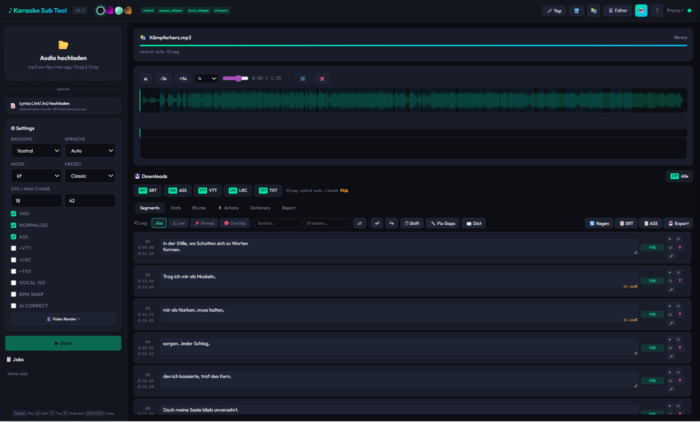
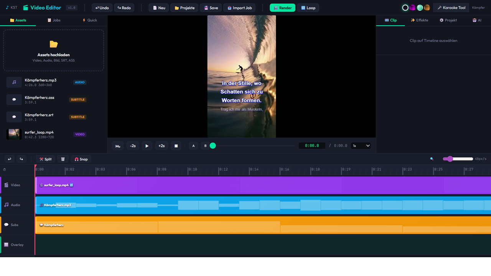

# 🎤 Karaoke Sub Tool

**Professioneller Karaoke-Untertitel-Generator mit Video-Editor, KI-Chat und 4 Transkriptions-Backends.**

> **Audio rein → Karaoke-Untertitel raus.** Wortgenau. Automatisch. In Sekunden.


<table>
<tr>
<td width="50%">

#### 🎙️ Transkription — 4 Backends, 1 Klick

| Backend | Typ | Highlight |
|---------|-----|-----------|
| **Voxtral** (Mistral AI) | Cloud | Diarization, schnellstes Setup |
| **OpenAI Whisper** | Cloud | Bewährte Qualität |
| **faster-whisper** | Lokal | 100 % offline, kein API-Key |
| **WhisperX** | Lokal | Forced Alignment, präziseste Wort-Timestamps |

</td>
<td width="50%">

#### ⚡ Auf einen Blick

- 🔤 **Wort-Level-Timestamps** mit Silben-Approximation
- 🗣️ **Speaker Diarization** — wer spricht wann?
- 🎵 **BPM-Erkennung + Beat-Snap** für rhythmische Untertitel
- 🧠 **KI-Korrektur** via PydanticAI (GPT-4o, Claude, Gemini, Mistral)
- 🎬 **Video-Editor** mit Timeline, Preview & Social-Media-Formate
- 📱 **1 Klick → TikTok / Reels / Shorts** (9:16, 1:1, 16:9, 4K)

</td>
</tr>
</table>

### Kernkonzepte

🎙️ **4 Transkriptions-Backends** — Voxtral (Mistral AI), OpenAI Whisper, faster-whisper (100 % offline), WhisperX (Forced Alignment)
&nbsp;&nbsp;→ Wort-Level-Timestamps · Speaker Diarization · VAD · Vocal Isolation

🤖 **PydanticAI v2 Chat-Agent** — Multi-Provider KI (OpenAI, Anthropic, Mistral, Google) mit 5 Commands + 8 Tools für automatische Textkorrektur, Übersetzung und Segment-Bearbeitung

🎬 **Integrierter Video-Editor** — Multi-Track-Timeline mit Echtzeit-Preview, Untertitel-Overlay, Karaoke-Rendering und Format-Presets (16:9, 9:16, 1:1, 4K)

📝 **6 Export-Formate** — SRT, ASS (mit `\k`/`\kf`/`\ko` Karaoke-Tags), VTT, LRC, TXT, Standalone HTML-Player

🔧 **Automatische Refinement-Pipeline** — CPS-Optimierung, Beat-Snap, Reimschema-Erkennung, Song-Struktur, Lyrics-Alignment, Konfidenz-Report

---



## ✨ Features

### 🎙️ Transkription
- **4 Backends**: Voxtral (Mistral AI), OpenAI Whisper, Local Whisper (faster-whisper), WhisperX
- Wort-Level-Timestamps mit automatischer Silben-Approximation
- Speaker Diarization (Sprechererkennung)
- Voice Activity Detection (WebRTC VAD)
- Vocal Isolation via Demucs

### 🎬 Video-Editor
- Multi-Track-Timeline (Video, Audio, Subtitle, Overlay)
- 3 Video-Skalierungsmodi: Füllen (Cover), Einpassen (Contain), Strecken (Stretch)
- Format-Vorlagen: 16:9 HD, 4K, 9:16 Vertical, 1:1 Square
- Effekte: Fade, Brightness, Contrast, Blur, Sepia, Vignette, u.v.m.
- Undo/Redo mit bis zu 50 Schritten
- Echtzeit-Vorschau mit Untertitel-Overlay
- ffmpeg-basiertes Rendering



### 📝 Untertitel-Formate
- **SRT** — Standard-Untertitel
- **ASS** — Advanced SubStation Alpha mit Karaoke-Tags (`\k`, `\kf`, `\ko`)
- **VTT** — WebVTT
- **LRC** — Enhanced LRC mit Wort-Level-Tags
- **TXT** — Plain Text
- **HTML** — Standalone Karaoke-Player

### 🎨 Karaoke-Themes
6 vordefinierte ASS-Presets mit anpassbaren Farben, Outline, Schatten und Fade-Effekten:
- Classic, Neon, High Contrast, Landscape 1080p, Portrait 1080×1920, Mobile Safe

### 🤖 KI-Chat
- PydanticAI v2 mit Multi-Provider-Support (OpenAI, Anthropic, Mistral, Google)
- 5 Commands: `correct`, `punctuate`, `structure`, `translate`, `generate`
- 8 Tools für Segment-Lesen und -Schreiben
- Reasoning-Model-Erkennung (o1, o3, GPT-5, Claude Opus)
- Chat-History pro Job

### 🔧 Refinement-Pipeline
- Text-Bereinigung (Whitespace, Quotes, Custom Dictionary)
- CPS Auto-Fix (Characters Per Second)
- Lücken-Management (♪-Fill, Redistribute)
- BPM-Erkennung + Beat-Snap (Essentia/librosa)
- Reimschema-Erkennung (DE/EN, Rap-optimiert)
- Song-Struktur-Erkennung (Verse/Chorus/Bridge/Hook)
- Textstatistik (TTR, Hapax, Flow-Score)
- Lyrics-Alignment (Greedy Matching)

### 📊 Qualitäts-Report
- Konfidenz-Bewertung pro Segment
- Detaillierter JSON/CSV-Report
- Low-Confidence-Markierung in ASS-Dateien

---

##  Installation

### Voraussetzungen

- **Python ≥ 3.10** (Ziel: 3.12)
- **ffmpeg** — Audio/Video-Verarbeitung
- Mindestens ein Transkriptions-Backend (API-Key oder lokales Modell)

### Setup

```bash
# Repository klonen
git clone https://github.com/Scalino1984/video-editor.git
cd video-editor

# Virtual Environment erstellen
python -m venv .venv
source .venv/bin/activate  # Linux/macOS
# .venv\Scripts\activate   # Windows

# Abhängigkeiten installieren
pip install -r requirements.txt
```

### API-Keys konfigurieren

Erstelle eine `.env`-Datei im Projektverzeichnis:

```env
# Transkription (mindestens einen Key)
MISTRAL_API_KEY=your-mistral-key        # Voxtral Backend
OPENAI_API_KEY=sk-your-openai-key       # OpenAI Whisper Backend
HF_TOKEN=hf_your-token                  # WhisperX Diarization

# KI-Chat (optional)
AI_MODEL=openai:gpt-4o                  # oder anthropic:claude-sonnet-4, mistral:*, google:*
```

### Optionale Abhängigkeiten

```bash
# WhisperX (präziseste Wort-Timestamps)
pip install whisperx torch torchaudio

# Local Whisper (kein API-Key nötig)
pip install faster-whisper

# Vocal Isolation
pip install demucs

# BPM-Erkennung
pip install essentia  # bevorzugt
pip install librosa   # Fallback
```

---

## 🖥️ Verwendung

### Server (WebUI + Video-Editor)

```bash
# Direktstart
python main.py

# Mit Optionen
python main.py --host 0.0.0.0 --port 8000 --reload

# Via Server-Manager
./server.sh start
./server.sh status
./server.sh log
./server.sh stop
```

Öffne im Browser:
- **WebUI**: [http://localhost:8000](http://localhost:8000)
- **Video-Editor**: [http://localhost:8000/editor](http://localhost:8000/editor)

### CLI

```bash
# Transkription
python -m src.cli transcribe --input audio.mp3 --backend voxtral --ass

# Batch-Verarbeitung
python -m src.cli transcribe --input ./songs/ --backend whisperx --ass --lrc

# Refinement
python -m src.cli refine --input subs/ --cps 18

# Export mit Karaoke-Tags
python -m src.cli export --input subs/ --karaoke-mode kf --preset neon

# Preview-Clip rendern
python -m src.cli preview --input song.srt --audio song.mp3

# Interaktives Menü
python -m src.cli menu
```

---

## ⚙️ Konfiguration

Die Konfiguration erfolgt über `config.yaml` im Projektverzeichnis:

```yaml
preprocess:
  vad:
    enabled: true
    aggressiveness: 2          # 0-3
  normalize:
    enabled: true
    target_lufs: -16.0
  vocal_isolation:
    enabled: false

transcription:
  backend: voxtral             # voxtral | openai_whisper | local_whisper | whisperx
  language: auto               # de | en | auto
  word_timestamps: auto

refinement:
  cps: 18.0                    # max Characters Per Second
  min_duration: 1.0
  max_duration: 6.0
  max_chars_per_line: 42

karaoke:
  mode: kf                     # k (fill) | kf (fade) | ko (outline wipe)
  fade_in_ms: 150
  fade_out_ms: 100

theme:
  preset: classic              # classic | neon | high_contrast | ...
```

CLI-Overrides via Dot-Notation:
```bash
python -m src.cli transcribe --input audio.mp3 \
  --set transcription.backend=whisperx \
  --set refinement.cps=20
```

---

## 📁 Projektstruktur

```
main.py                          ← FastAPI-App + Uvicorn
server.sh                        ← Server-Manager-Script
config.yaml                      ← Konfiguration
src/
  cli.py                         ← Typer CLI
  api/
    models.py                    ← Pydantic v2 Schemas
    routes.py                    ← REST-API (60+ Endpunkte)
    tasks.py                     ← Background-Jobs (SSE, Undo/Redo)
  transcription/
    voxtral.py                   ← Mistral AI Voxtral
    openai_whisper.py            ← OpenAI Whisper API
    local_whisper.py             ← faster-whisper (lokal)
    whisperx_backend.py          ← WhisperX + Forced Alignment
  refine/
    alignment.py                 ← Wort-Timestamp-Approximation
    segmentation.py              ← Split/Merge/Gaps/Line-Breaks
    beatgrid.py                  ← BPM-Erkennung + Beat-Snap
    confidence.py                ← Qualitäts-Report
    lyrics_align.py              ← Lyrics→ASR Alignment
    rhyme.py                     ← Reimschema-Erkennung
    structure.py                 ← Song-Struktur-Erkennung
  export/
    srt_writer.py                ← SRT
    ass_writer.py                ← ASS mit Karaoke-Tags
    vtt_writer.py                ← WebVTT
    lrc_writer.py                ← Enhanced LRC
    karaoke_html.py              ← Standalone HTML-Player
    karaoke_tags.py              ← ASS \k/\kf/\ko Generator
    themes.py                    ← 6 ASS-Presets
  ai/
    chat.py                      ← PydanticAI v2 Agent
    routes.py                    ← Streaming-Chat-API
  video/
    editor.py                    ← Timeline-Editor
    editor_routes.py             ← Editor REST-API
    render.py                    ← ffmpeg Video-Rendering
  static/
    index.html                   ← WebUI SPA
    editor.html                  ← Video-Editor SPA
data/
  uploads/                       ← Hochgeladene Dateien
  output/{job_id}/               ← Job-Artefakte
  editor/                        ← Editor Assets & Renders
  library.sqlite                 ← Library-Datenbank
```

---

## 🔌 API

Die REST-API läuft unter `/api/` mit 60+ Endpunkten. Vollständige Dokumentation:

- **Swagger UI**: [http://localhost:8000/docs](http://localhost:8000/docs)
- **ReDoc**: [http://localhost:8000/redoc](http://localhost:8000/redoc)

### Wichtige Endpunkte

| Methode | Pfad | Beschreibung |
|---------|------|-------------|
| `POST` | `/api/transcribe` | Neuen Transkriptions-Job starten |
| `GET` | `/api/jobs/{id}` | Job-Status abfragen |
| `GET` | `/api/jobs/{id}/segments` | Segmente laden |
| `PUT` | `/api/jobs/{id}/segments/{idx}` | Segment bearbeiten |
| `POST` | `/api/jobs/{id}/export` | Export auslösen |
| `POST` | `/api/chat/{id}` | KI-Chat (NDJSON Streaming) |
| `POST` | `/api/editor/projects` | Editor-Projekt erstellen |
| `POST` | `/api/editor/projects/{id}/render` | Video rendern |

---

## 🧪 Tests

```bash
# Alle Tests
pytest tests/

# Einzelne Test-Suites
pytest tests/test_core.py -v        # Core (Serialisierung, Writer, Refinement)
pytest tests/test_library.py        # Library-DB
pytest tests/test_v31.py            # v3.1 Features

# Mit Coverage
pytest tests/ --cov=src --cov-report=html
```

Aktuell: **107 Tests**, alle bestanden.

---

## 🎵 Pipeline

```
Audio → Vocal Isolation? → WAV 16kHz → Normalize? → VAD?
  → Transkription → Text Cleanup → Word Timestamps → Segmentation
  → Lyrics Alignment? → BPM Snap? → KI-Korrektur?
  → Export (SRT/ASS/VTT/LRC/TXT/HTML)
  → Konfidenz-Report → Preview? → Library
```

---

## 🎹 Transkriptions-Backends

| Backend | API-Key | Word-Timestamps | Diarization | Bemerkung |
|---------|---------|-----------------|-------------|-----------|
| **Voxtral** | `MISTRAL_API_KEY` | ✅ | ✅ | Standard-Backend |
| **OpenAI Whisper** | `OPENAI_API_KEY` | ✅ | ❌ | `whisper-1` Modell |
| **Local Whisper** | — | ✅ | ❌ | Kein API-Key, GPU optional |
| **WhisperX** | `HF_TOKEN` (optional) | ✅✅ | ✅ | Forced Alignment, präziseste Timestamps |

---

## 🎨 Video-Editor

Der integrierte Video-Editor ermöglicht:

- Drag & Drop von Video, Audio, Untertitel und Overlay auf die Timeline
- Echtzeit-Vorschau mit Untertitel-Rendering
- 3 Video-Skalierungsmodi pro Projekt
- Untertitel-Styling (Font, Größe, Farbe, Outline, Position, Zeilen)
- KI-Assistent für Clip-Bearbeitung
- Rendering zu MP4 mit libx264

### Format-Presets

| Preset | Auflösung | Verwendung |
|--------|-----------|-----------|
| 16:9 HD | 1920×1080 | YouTube, Standard |
| 4K | 3840×2160 | Ultra HD |
| 9:16 Vert | 1080×1920 | TikTok, Reels, Shorts |
| 1:1 Square | 1080×1080 | Instagram |

---

## 🤝 Mitwirken

Beiträge sind willkommen! Bitte beachte:

1. **Code-Sprache**: Englisch (Code + Kommentare), Deutsch (UI + Prompts)
2. **Linter**: `ruff` mit 120 Zeichen Zeilenlänge
3. **Type-Hints**: Überall, `X | None` statt `Optional[X]`
4. **Tests**: `pytest` mit `asyncio_mode = "auto"`
5. **Imports**: `from __future__ import annotations` in jeder Datei

```bash
# Linter
ruff check src/ tests/
ruff format src/ tests/

# Tests
pytest tests/ -v
```

---

## 📄 Lizenz

MIT License — siehe [LICENSE](LICENSE) für Details.

---

## 🙏 Credits

- [FastAPI](https://fastapi.tiangolo.com/) — Web-Framework
- [Typer](https://typer.tiangolo.com/) — CLI-Framework
- [PydanticAI](https://ai.pydantic.dev/) — KI-Agent-Framework
- [faster-whisper](https://github.com/SYSTRAN/faster-whisper) — Lokale Transkription
- [WhisperX](https://github.com/m-bain/whisperX) — Forced Alignment
- [Demucs](https://github.com/facebookresearch/demucs) — Vocal Isolation
- [Essentia](https://essentia.upf.edu/) — BPM-Erkennung
- [Rich](https://rich.readthedocs.io/) — Terminal-Formatierung
- [ffmpeg](https://ffmpeg.org/) — Audio/Video-Verarbeitung
